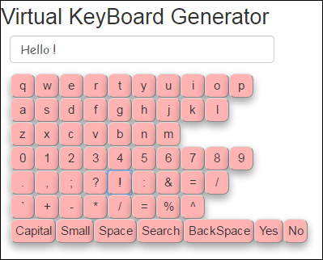
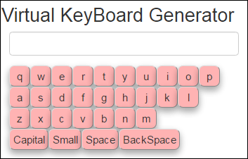
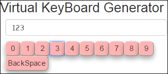
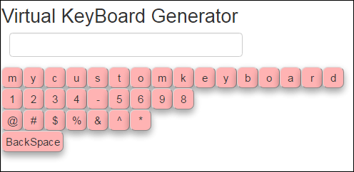

# Virtual-Keyboard-Generator
This web application helps the user to generate a virtual keyboard of his own preference.
The keyboard supports normal keys and user-defined action keys also. These action Keys like 'GO','SEARCH',etc work accoording to the callback function provided.<br>
Click on http://tub99.github.io/VirtualKeyboard/index.html to get a feel of this virtual keyboard

## Creating a keyboard with all keys.
``` javascript
var keyPadHolder=document.getElementById("keyboard"),
	targetField=document.getElementById("target"),
	kbObject=new MyKeyBoard(),
	keyType=new KeyType(),
	//Adding the action/special keys
	actionArr=[keyType.getAction().btCapital ,keyType.getAction().btSmall ,keyType.getAction().btSpace,keyType.getAction().btSearch,
	keyType.getAction().btBackSpace,keyType.getAction().btYes,keyType.getAction().btNo],
	//adding normal keys like alphabets,numbers,symbols,mathematical operators
	kTypeArr=[[keyType.getAlphabets().alp1],[keyType.getAlphabets().alp2],[keyType.getAlphabets().alp3],[keyType.getNumerics()],
	[keyType.getSymbols()],[keyType.getMath()]];

//Creating the keypad
//function addkeyPad(keyPadHolder,normalkeyArr,actionKeyArr,targetField or textfield, callbackfor action Key,maximum Chars,gap)
kbObject.addkeyPad(keyPadHolder,kTypeArr,actionArr,targetField,null,0,0);// callback is made null by default
//Adding Draggable feature to keypad
kbObject.addDraggableFeature("#keyboard");
```
<p> FULL KEYBOARD </p>
<p> </img></p>

## A qwert keyboard contains all alphabets in keyboard form.
<p> QWERTY KEYBOARD </p>
<p> </img></p>

## A numeric keypad contains numeric digits like 1,2,3 etc
<p> Numeric KEYBOARD </p>
<p> </img></p>

## Creating a custom keyboard ie a user defined one where the user can include keys of his own choice
``` javascript
var keyPadHolder=document.getElementById("keyboard"),
	targetField=document.getElementById("target"),
	kbObject=new MyKeyBoard(),
	keyType=new KeyType(),
	//inserting special keys eg: backspace
	actionArr=[keyType.getAction().btBackSpace],
	// inserting custom keys as Array of strings
	kTypeArr=[['mycustomkeyboard'],['1234-5698'],['@#$%&^*']];

//Creating the keypad
kbObject.addkeyPad(keyPadHolder,kTypeArr,actionArr,targetField,null,0,0);
//Adding Draggable feature to keypad
kbObject.addDraggableFeature("#keyboard");


```
<p> Custom KEYBOARD </p>
<p> </img></p>


